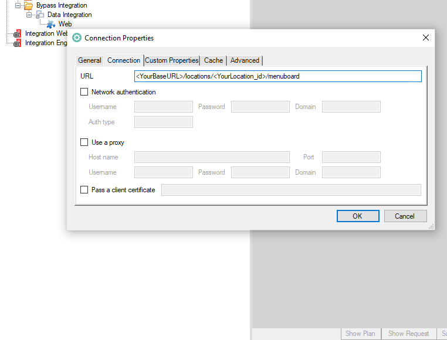
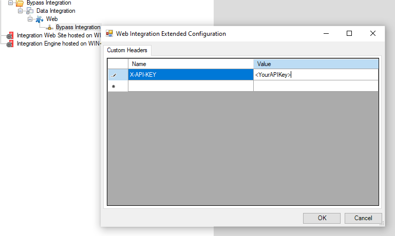

# Bypass-Integration
 FWI integration into Bypass POS for menuboard signage

**Disclaimer:** These instructions are intended for use by Four Winds Interactive personel and are unlikely to be helpful for non-FWI employees.  

This tutorial also assumes basic understanding of FWI systems--specifically Integration Frameworks and Content Manager (Live Data Editor).

## Getting Started

The full API documentation is only accessible to Four Winds Interactive Employees and can be found [here](https://fourwindsinteractivehq-my.sharepoint.com/:u:/g/personal/will_karges_fourwindsinteractive_com/Ee7Tov4h0IlFpikTidP4UWUBiB4ITTSOEaC-13saXq4YDg?e=pP7Q9R).

Before you can utilize and Bypass APIs you'll need to obtain a few things:


* `baseUrl` - First and foremost you'll need the `BaseURL` to make GET requests to.

* `location_id` - You'll need the Location Id(s) for all the outlets from which you wan to pull menuboard data.

* `X-API-KEY` - You'll need to apply the api key as a header in the GET request(s).  This is unique per property.

All of this information should be obtained from the Bypass representative for your designated property/client.

## Implementing the Integration

1. With your Bypass credentials obtained, you'll need to go into Integration Frameworks and setup a new Web Adapter.  There are a few different Bypass APIs but the most common is the GET Menu for a given location:

```
GET <YourBaseURL>/locations/<YourLocation_id>/menuboard
```

2. Update the `baseUrl` and `location_id` and update that string to the Connection URL for your IF Web Adpter.



3. Right click on the IF Connection and go to Extended properties, update with your `X-API-KEY` header.

| `X-API-KEY` | `<YourAPIKey>` |
| --------- | ------------ |



4. Set your data format to text and submit the request to ensure your integration is working.

5. If you get a successful response you'll then need to apply two actions to the request:

* Convert to XML

* Run Transform

The latter action will allow you to apply a stylesheet to the response to clean up the data.  You can use the [stylesheet](assets/BypassStylesheet.xsl) in this repo.  You can alternatively apply this stylesheet within the Live Data.
